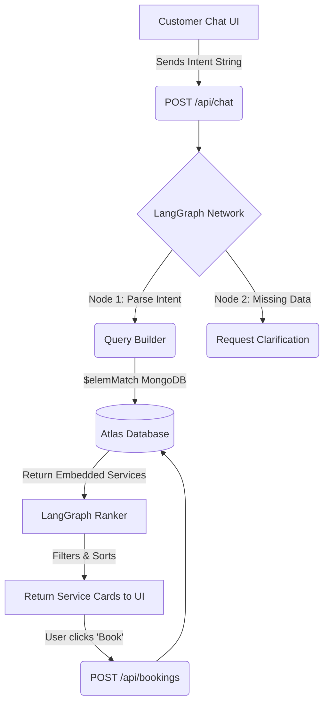

# 🗓️ ScheduleAI - Universal Service Booking Engine

ScheduleAI is an enterprise-grade, full-stack Universal Service Booking platform powered by Generative AI. It radically transforms how businesses acquire bookings and how users discover services, doing away with complex dropdowns and messy web-pages in favor of **natural conversational logic**.

The system utilizes a powerful **LangGraph AI Agent** (powered by Google Gemini) paired with a deeply integrated, highly dynamic **Embedded MongoDB State**. 

---

## 🌟 Comprehensive Feature Set

### 1. Generative AI Chat & Booking Orchestration
- **Contextual Understanding:** Clients simply type what they need (e.g. *"I need a dental checkup and a deep cleaning on Friday"*). ScheduleAI understands the context, filters the raw intent, and extracts the parameters natively.
- **Dynamic Retrieval (LangGraph):** The agent dynamically searches all real-time providers via a custom MongoDB `$elemMatch` strategy inside an embedded Business profiles array, retrieving precisely matching businesses and returning them seamlessly over the UI as interactive Service Cards.

### 2. Dual-Faced Unified Dashboards
- **Customer Portal:** Dedicated contextual dashboard where authenticated users interact with the Chat AI, view active booking suggestions, review real-time booking history, and cancel or reschedule previous bookings.
- **Service Provider Hub:** Complete isolation and independence. Providers get their own dashboard granting them maximum control over their business payload. 

### 3. "Embedded State" Business Profile System
Instead of archaic relational tables that slow down compute speeds:
- Providers possess an **Unlimited Array State** fully serialized within their core Database Document.
- From the Dashboard UI, a single provider can create an unlimited number of discrete `services` (e.g., *Haircut `[Tags: Men, Styling]`, Bridging `[Tags: Dental]`*) natively editing prices and descriptions independently.
- **Zero API lag:** The AI queries the MongoDB documents in linear, raw execution natively un-packing the exact service from inside the larger JSON document. 

---

## 🏗️ System Architecture & Workflow



---

## 📁 Source Code Directory Structure

The repository is mapped as a decoupled full-stack architecture separated strictly into `frontend` (Next.js) and `backend` (FastAPI).

```bash
Scheduler-AI/
├── app/                        # Next.js App Router (Frontend)
│   ├── api/                    # UI Endpoints (Bridges to FastAPI/MongoDB)
│   │   ├── auth/               # Custom JWT Login/Register/Logout Auth
│   │   ├── bookings/           # Booking Creation & Ledger retrieval
│   │   ├── chat/               # LangGraph Proxy Fetch Handler
│   │   └── provider/profile/   # Unified Embedded Service Profile Upserts
│   ├── dashboard/              # Protected Dashboards
│   │   ├── client/             # Service Provider Admin View
│   │   └── user/               # Customer AI Chat View
│   └── page.tsx                # Beautiful Landing Page & Marketing Hero
├── backend/                    # Python FastAPI (Microservice)
│   ├── main.py                 # FastAPI Server Initialization
│   ├── agent.py                # 6-Node LangGraph Orchestration & AI Logic
│   ├── database.py             # Motor AsyncDB connections
│   ├── models.py               # Pydantic Schemas & Type validations
│   └── seed_db.py              # Sandbox Environment Initializer
├── components/                 # React UI Elements
│   ├── ui/                     # Shadcn UI (Buttons, Cards, Inputs, Tabs)
│   └── service-card.tsx        # Dynamic Render for AI Search Results
├── lib/                        # Configurations
│   ├── auth.ts                 # Custom JWT Signature Handlers
│   └── mongodb.ts              # Native Mongo Client instances
├── public/                     # Static Assests (Developer Profiles)
└── .env.local                  # Environment Configuration
```

---

## 🚀 Local Development Configuration

Setting up the project requires spinning up the decoupled layers concurrently over individual local server threads.

### 1. Environment Configurations
You must construct two `.env` files. Ensure you have an active MongoDB Atlas cluster and a Google AI Studio account.

**Root Next.js Layer (`.env.local`):**
```env
NEXT_PUBLIC_API_URL=http://localhost:8000
```
**Python Backend Layer (`backend/.env`):**
```env
GEMINI_API_KEY=your_gemini_api_key
MONGODB_URI=your_mongodb_cluster_string
MONGODB_DB_NAME=scheduleai
```

### 2. Dependency Installation

**Front-End Node Dependencies:**
```bash
# In the root repository
npm install
```

**Back-End Python Dependencies:**
```bash
cd backend
python -m venv venv

# Activate the venv
.\venv\Scripts\activate      # Windows PowerShell
source venv/bin/activate     # Mac/Linux Bash

pip install -r requirements.txt
```

### 3. Initialize & Seed Platform Database
Before booting the dashboard, you must configure the database structure by natively wiping the legacy architecture and mapping mock provider objects to start matching logic.
```bash
# Inside the backend folder with VENV activated
python seed_db.py
```

### 4. Running the Platform
A powerful execution script (`start_servers.ps1`) is bundled in the root. Running this securely spins up both the **Next.js Frontend (`localhost:3000`)** and the **FastAPI Backend (`localhost:8000`)** concurrently.
```bash
# In the root repository
.\start_servers.ps1
```

---

## 👥 Developers & Contributors

Architected perfectly by:
* **Mayukh Banerjee** - [GitHub](https://github.com/MayukhBanerjee) | [LinkedIn](https://www.linkedin.com/in/mayukh-banerjee)
* **Naif Naqeeb** - [GitHub](https://github.com/naifnaqeeb) | [LinkedIn](https://www.linkedin.com/in/naifnaqeeb/)
