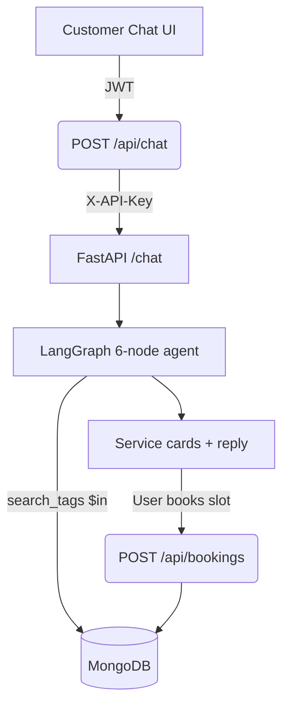

# ScheduleAI — Universal Service Booking Engine

ScheduleAI is a full-stack conversational booking platform. Customers discover and book local services through natural language (and optional voice input). Providers manage services and availability from a dedicated dashboard. A **LangGraph** agent (Gemini) parses intent and phrases replies; retrieval, ranking, and availability are **deterministic Python** over MongoDB `search_tags`.

---

## Features

### AI chat booking
- Multi-turn clarification (e.g. “haircut” → “tomorrow afternoon”)
- Tag-indexed provider search (`search_tags: { $in: [...] }`)
- Verified slots only — no hallucinated availability
- Conflict-safe bookings with slot consumption

### Dual dashboards
- **Customer:** AI chat, Web Speech mic → chat (Chrome/Edge), ScheduleAI calendar, cancel bookings
- **Provider:** profile, services, availability overrides, calendar (month/week/day), cancel/complete bookings

### Calendar
- Internal Mongo-backed booking calendar for both roles
- Voice input via browser **Web Speech API** (no server STT)
- Google Calendar OAuth sync is **out of scope** for the current ship

---

## Architecture


```mermaid
graph TD;
    A[Customer Chat UI] -->|JWT| B(POST /api/chat);
    B -->|X-API-Key| C[FastAPI /chat];
    C --> D[LangGraph 6-node agent];
    D -->|search_tags $in| E[(MongoDB)];
    D --> F[Service cards + reply];
    F -->|User books slot| G(POST /api/bookings);
    G --> E;
```

---

## Local setup

### 1. Environment

**Root `.env.local`** (see `.env.example`):
```env
MONGODB_URI=mongodb://localhost:27017
MONGODB_DB_NAME=scheduleai
JWT_SECRET=change-me-to-a-long-random-string
BACKEND_URL=http://localhost:8000
NEXT_PUBLIC_BACKEND_URL=http://localhost:8000
BACKEND_API_KEY=change-me-shared-api-key
```

**`backend/.env`** (see `backend/.env.example`):
```env
GEMINI_API_KEY=your_gemini_api_key
MONGODB_URI=mongodb://localhost:27017
MONGODB_DB_NAME=scheduleai
BACKEND_API_KEY=change-me-shared-api-key
```

`BACKEND_API_KEY` must match on both sides.

### 2. Install

```bash
npm install

cd backend
python -m venv venv
.\venv\Scripts\activate      # Windows
# source venv/bin/activate  # Mac/Linux
pip install -r requirements.txt
```

### 3. Seed

```bash
cd backend
python seed_db.py
```

Demo accounts (password `demo1234`):
- Customer: `demo@scheduleai.com`
- Providers: e.g. `thestylestudio@demo.com`, `citydentalclinic@demo.com`

### 4. Run

```bash
.\start_servers.ps1
```

- Frontend: http://localhost:3000  
- Backend: http://localhost:8000  

---

## Directory map

```
Scheduler-AI/
├── app/                 # Next.js App Router
├── backend/             # FastAPI + LangGraph agent
├── components/          # UI (shadcn + booking calendar)
├── lib/                 # JWT auth, Mongo client
└── start_servers.ps1    # Dev bootstrap
```

---

## Demo acceptance checklist

After `python seed_db.py` and `.\start_servers.ps1`:

1. Login `demo@scheduleai.com` / `demo1234` → customer dashboard  
2. Chat “I need a haircut” → clarify → “tomorrow afternoon” → real slots  
3. Book a slot → appears on My bookings + ScheduleAI calendar  
4. Book the same slot again → conflict error  
5. Provider login → cancel/complete booking in modal  
6. Mic in Chrome/Edge → transcript fills chat  
7. Landing “I’m a Business” → signup role `provider`  
8. `curl` FastAPI `/chat` without `X-API-Key` → 401 (when `BACKEND_API_KEY` is set)

See also [DEPLOY.md](DEPLOY.md) for optional hosting.


- **Mayukh Banerjee** — [GitHub](https://github.com/MayukhBanerjee) | [LinkedIn](https://www.linkedin.com/in/mayukh-banerjee)
